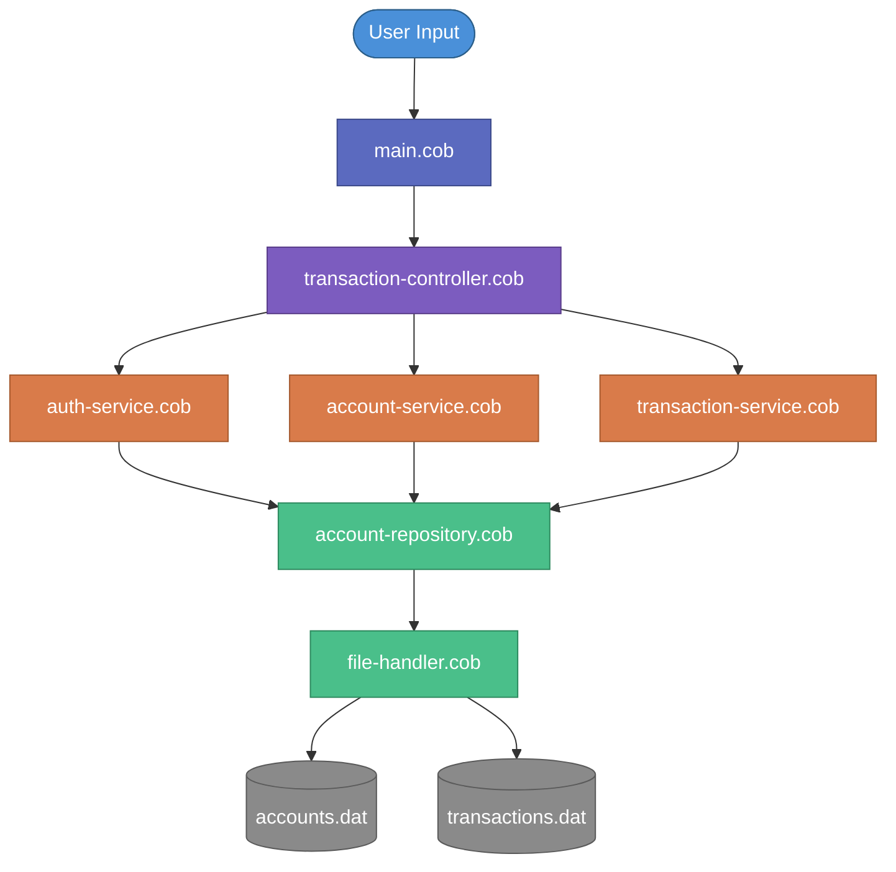

# Tally

A lightweight ATM engine for simulating secure cash transactions, account management, and financial operations.

[](LICENSE)
[](https://gnucobol.sourceforge.io/)

---

## Table of Contents

- [Overview](#overview)
- [Why COBOL?](#why-cobol)
- [Features](#features)
- [Architecture](#architecture)
  - [Layered Design](#layered-design)
  - [Data Flow](#data-flow)
  - [Project Structure](#project-structure)
- [Prerequisites](#prerequisites)
- [Getting Started](#getting-started)
  - [Installation](#installation)
  - [Compilation](#compilation)
  - [Running](#running)
- [Usage](#usage)
- [Data Files](#data-files)
  - [accounts.dat](#accountsdat)
  - [transactions.dat](#transactionsdat)
- [Module Reference](#module-reference)
- [Security Considerations](#security-considerations)
- [Roadmap](#roadmap)
- [Contributing](#contributing)
- [License](#license)

---

## Overview

Tally is a terminal-based ATM simulation that models the core operations of a real ATM system: user authentication, balance inquiries, cash deposits, withdrawals, and full transaction history. Built entirely in COBOL, it demonstrates how classic financial software architectures handle secure, reliable monetary operations using structured, layered design and flat-file persistence.

The project serves as both a functional ATM simulator and a reference implementation for anyone studying financial systems, mainframe-era patterns, or COBOL programming in a modern environment.

## Why COBOL?

COBOL powers an estimated **95% of ATM transactions worldwide** and processes roughly **3 trillion dollars** in daily commerce. Despite being over 60 years old, it remains the backbone of banking, insurance, and government systems. Tally embraces COBOL to:

- **Demonstrate real-world patterns** - the same layered, transaction-safe architecture used in production financial systems
- **Provide a learning platform** - a complete, readable COBOL project with modern software engineering practices (separation of concerns, modular design)
- **Preserve institutional knowledge** - as the COBOL workforce retires, projects like Tally help bridge the knowledge gap

## Features

### Core Banking Operations

- **PIN Authentication** - Secure login flow with PIN validation and lockout protection
- **Balance Inquiry** - Real-time account balance retrieval
- **Cash Deposits** - Credit funds to an account with immediate balance update
- **Cash Withdrawals** - Debit funds with insufficient-balance checks and daily limit enforcement
- **Account Management** - Create, view, update, and close customer accounts

### Transaction Processing

- **Atomic Operations** - Each transaction either completes fully or not at all
- **Transaction Logging** - Every operation is recorded with timestamps, amounts, and status codes
- **Transaction History** - Query past activity by account, date range, or transaction type

### System Integrity

- **Input Validation** - Rejects malformed amounts, negative values, and out-of-range inputs
- **Structured Error Handling** - Consistent error codes and messages across all modules
- **Audit Logging** - Full operational trace for debugging and compliance

---

## Architecture

### Layered Design

Tally follows a strict layered architecture that cleanly separates concerns:

```
┌─────────────────────────────────────────┐
│              main.cob                   │  Entry point / Menu loop
├─────────────────────────────────────────┤
│        transaction-controller.cob       │  Controller - routes input to services
├──────────┬──────────┬───────────────────┤
│ auth     │ account  │ transaction       │  Services - business logic
│ service  │ service  │ service           │
├──────────┴──────────┴───────────────────┤
│ account-repository.cob                  │  Repository - data access
│ file-handler.cob                        │  File I/O abstraction
├─────────────────────────────────────────┤
│ account.cob     transaction.cob         │  Models - data structures
├─────────────────────────────────────────┤
│ logger.cob      validation.cob          │  Utils - cross-cutting helpers
└─────────────────────────────────────────┘
```

| Layer                 | Responsibility                                                         |
| --------------------- | ---------------------------------------------------------------------- |
| **Entry Point**       | Displays the ATM menu, captures user choices, and drives the main loop |
| **Controller**        | Interprets user actions and delegates to the appropriate service       |
| **Services**          | Encapsulates business rules for auth, accounts, and transactions       |
| **Data / Repository** | Persists and retrieves records from flat data files                    |
| **Models**            | Defines copybook-style data structures for accounts and transactions   |
| **Utils**             | Provides logging, input validation, and shared helper routines         |

### Data Flow



### Project Structure

```
tally/
├── data/                                       # Persistent data files
│   ├── accounts.dat                            #   Account records
│   └── transactions.dat                        #   Transaction log
├── docs/
│   └── 001-ARCHITECTURE.md                     # Architecture deep-dive
├── src/
│   ├── main.cob                                # Application entry point
│   ├── controller/
│   │   └── transaction-controller.cob          # Routes user actions to services
│   ├── data/
│   │   ├── account-repository.cob              # Account CRUD operations
│   │   └── file-handler.cob                    # Low-level file I/O
│   ├── models/
│   │   ├── account.cob                         # Account data structure
│   │   └── transaction.cob                     # Transaction data structure
│   ├── services/
│   │   ├── account-service.cob                 # Account business logic
│   │   ├── auth-service.cob                    # Authentication & PIN validation
│   │   └── transaction-service.cob             # Deposit / withdrawal logic
│   └── utils/
│       ├── logger.cob                          # Operation logging
│       └── validation.cob                      # Input validation helpers
├── LICENSE
└── README.md
```

---

## Prerequisites

- A COBOL compiler - [GnuCOBOL](https://gnucobol.sourceforge.io/) **3.0+** recommended
- A POSIX-compatible terminal (macOS, Linux, or WSL on Windows)

---

## Getting Started

### Installation

Install GnuCOBOL for your platform:

**macOS (Homebrew):**

```bash
brew install gnucobol
```

**Ubuntu / Debian:**

```bash
sudo apt-get update && sudo apt-get install gnucobol
```

**Fedora / RHEL:**

```bash
sudo dnf install gnucobol
```

**Windows (WSL):**

```bash
# Inside your WSL distribution
sudo apt-get update && sudo apt-get install gnucobol
```

Verify the installation:

```bash
cobc --version
```

### Compilation

Clone and build the project:

```bash
git clone https://github.com/zugobite/tally.git
cd tally

cobc -x -o tally src/main.cob \
    src/controller/*.cob \
    src/services/*.cob \
    src/data/*.cob \
    src/models/*.cob \
    src/utils/*.cob
```

### Running

```bash
./tally
```

---

## Usage

Once launched, Tally presents an interactive ATM menu:

```
========================================
         WELCOME TO TALLY ATM
========================================

  [1] Log In
  [2] Create Account
  [3] Exit

  Enter choice: _
```

After authenticating, the main operations become available:

```
========================================
           ATM MAIN MENU
========================================

  [1] Check Balance
  [2] Deposit
  [3] Withdraw
  [4] Transaction History
  [5] Account Details
  [6] Logout

  Enter choice: _
```

### Typical Session

1. **Create an account** - provide your name and set a 4-digit PIN
2. **Login** - enter your account number and PIN
3. **Deposit funds** - credit your account with an initial amount
4. **Withdraw cash** - debit funds (must not exceed available balance)
5. **View history** - review all past transactions on the account
6. **Logout** - return to the welcome screen

---

## Data Files

All persistent state lives in `data/` as fixed-width flat files - the same storage paradigm used by legacy mainframe systems.

### accounts.dat

Stores one record per line with the following fields:

| Field          | Description                     |
| -------------- | ------------------------------- |
| Account Number | Unique numeric identifier       |
| PIN (hashed)   | 4-digit personal identification |
| Holder Name    | Full name of the account owner  |
| Balance        | Current available balance       |
| Status         | Active / Frozen / Closed        |
| Created Date   | Account creation timestamp      |

### transactions.dat

Append-only log - records are never modified or deleted:

| Field          | Description                           |
| -------------- | ------------------------------------- |
| Transaction ID | Auto-incrementing unique identifier   |
| Account Number | The account involved                  |
| Type           | DEPOSIT, WITHDRAWAL, or TRANSFER      |
| Amount         | Transaction amount                    |
| Balance After  | Account balance after the transaction |
| Timestamp      | Date and time of the operation        |
| Status         | SUCCESS or FAILED                     |

---

## Module Reference

| Module                     | Path                                        | Purpose                                                          |
| -------------------------- | ------------------------------------------- | ---------------------------------------------------------------- |
| **Main**                   | `src/main.cob`                              | Entry point; displays menus and drives the application loop      |
| **Transaction Controller** | `src/controller/transaction-controller.cob` | Parses user choices and routes to the correct service            |
| **Auth Service**           | `src/services/auth-service.cob`             | Validates PINs, manages login sessions, enforces lockout policy  |
| **Account Service**        | `src/services/account-service.cob`          | Creates accounts, retrieves details, updates status              |
| **Transaction Service**    | `src/services/transaction-service.cob`      | Executes deposits and withdrawals, enforces balance rules        |
| **Account Repository**     | `src/data/account-repository.cob`           | CRUD interface for account records in `accounts.dat`             |
| **File Handler**           | `src/data/file-handler.cob`                 | Low-level sequential file open / read / write / close operations |
| **Account Model**          | `src/models/account.cob`                    | Defines the account record layout (copybook)                     |
| **Transaction Model**      | `src/models/transaction.cob`                | Defines the transaction record layout (copybook)                 |
| **Logger**                 | `src/utils/logger.cob`                      | Writes timestamped log entries for audit and debugging           |
| **Validation**             | `src/utils/validation.cob`                  | Validates numeric input, PIN format, and amount ranges           |

---

## Security Considerations

Tally is a simulation intended for educational use. The following practices are implemented to mirror real-world ATM security patterns:

- **PIN handling** - PINs are validated in memory and never displayed back to the user
- **Session isolation** - each authenticated session is scoped to a single account
- **Input sanitization** - all user input passes through `validation.cob` before reaching business logic
- **Audit trail** - every operation is logged with a timestamp for post-hoc review
- **Fail-safe defaults** - invalid or unexpected input results in a safe rejection, not a crash

> **Note:** This is a learning project. Production ATM systems employ hardware security modules (HSMs), encrypted PIN blocks (ISO 9564), and network-level encryption that are beyond the scope of this simulator.

---

## Roadmap

- [ ] Fund transfers between accounts
- [ ] Daily withdrawal limit enforcement
- [ ] Mini-statement receipt generation
- [ ] Multi-currency support
- [ ] Admin console for account oversight
- [ ] Automated test suite

---

## Contributing

Contributions are welcome! To get started:

1. Fork the repository
2. Create a feature branch (`git checkout -b feature/my-feature`)
3. Commit your changes (`git commit -m "Add my feature"`)
4. Push to the branch (`git push origin feature/my-feature`)
5. Open a Pull Request

Please ensure your COBOL follows the existing code style and that all modules compile cleanly with GnuCOBOL 3.0+.

---

## License

This project is licensed under the MIT License - see the [LICENSE](LICENSE) file for details.
