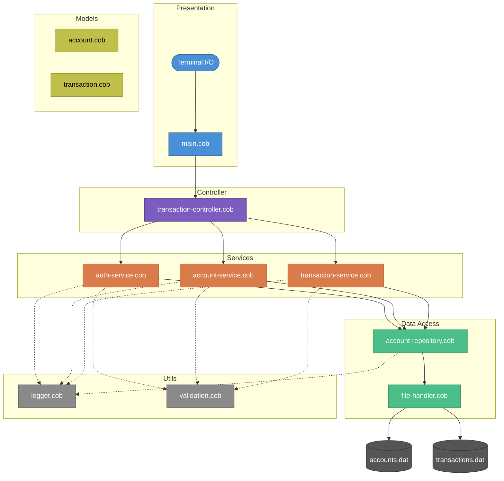
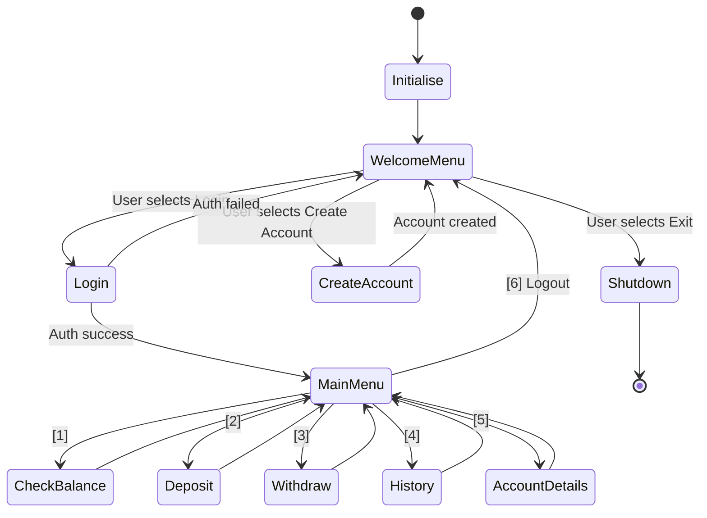
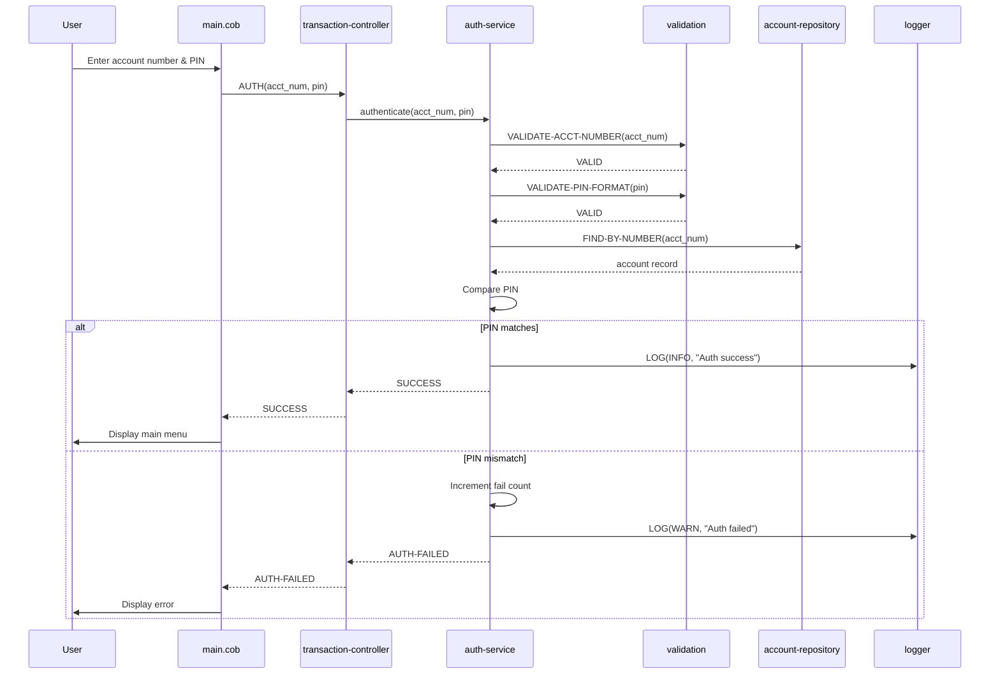
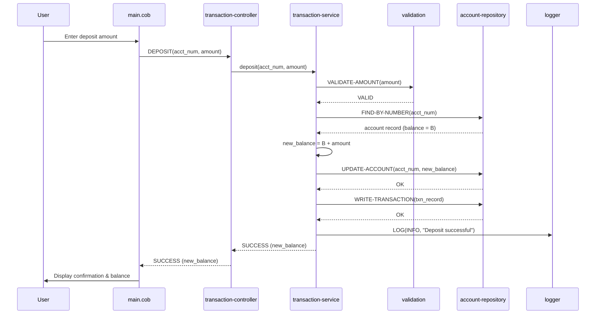
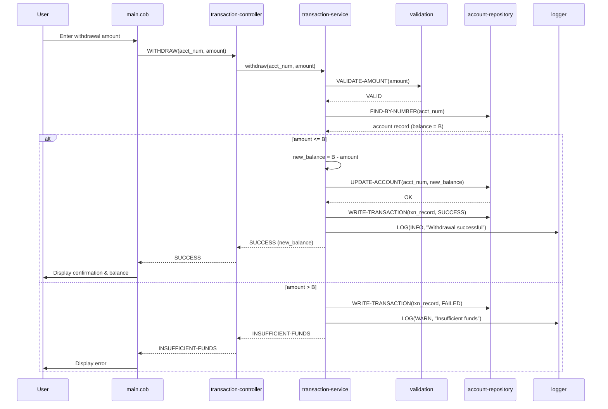
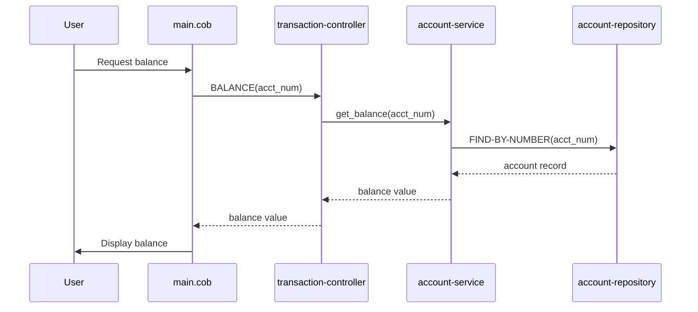

# Architecture Document

> Tally - A lightweight ATM engine for simulating secure cash transactions, account management, and financial operations.

**Version:** 1.0  
**Last Updated:** 18 March 2026  
**Author:** [Zascia Hugo](https://github.com/zugobite)

---

## Table of Contents

- [1. Introduction](#1-introduction)
  - [1.1 Purpose](#11-purpose)
  - [1.2 Scope](#12-scope)
  - [1.3 Definitions & Terminology](#13-definitions--terminology)
- [2. Architectural Goals & Constraints](#2-architectural-goals--constraints)
  - [2.1 Goals](#21-goals)
  - [2.2 Constraints](#22-constraints)
  - [2.3 Design Principles](#23-design-principles)
- [3. System Overview](#3-system-overview)
- [4. Layered Architecture](#4-layered-architecture)
  - [4.1 Presentation Layer](#41-presentation-layer)
  - [4.2 Controller Layer](#42-controller-layer)
  - [4.3 Service Layer](#43-service-layer)
  - [4.4 Data Access Layer](#44-data-access-layer)
  - [4.5 Model Layer](#45-model-layer)
  - [4.6 Utility Layer](#46-utility-layer)
- [5. Module Specifications](#5-module-specifications)
  - [5.1 main.cob](#51-maincob)
  - [5.2 transaction-controller.cob](#52-transaction-controllercob)
  - [5.3 auth-service.cob](#53-auth-servicecob)
  - [5.4 account-service.cob](#54-account-servicecob)
  - [5.5 transaction-service.cob](#55-transaction-servicecob)
  - [5.6 account-repository.cob](#56-account-repositorycob)
  - [5.7 file-handler.cob](#57-file-handlercob)
  - [5.8 account.cob](#58-accountcob)
  - [5.9 transaction.cob](#59-transactioncob)
  - [5.10 logger.cob](#510-loggercob)
  - [5.11 validation.cob](#511-validationcob)
- [6. Data Architecture](#6-data-architecture)
  - [6.1 Storage Strategy](#61-storage-strategy)
  - [6.2 Account Record Layout](#62-account-record-layout)
  - [6.3 Transaction Record Layout](#63-transaction-record-layout)
  - [6.4 Data Integrity](#64-data-integrity)
- [7. Control Flow](#7-control-flow)
  - [7.1 Application Lifecycle](#71-application-lifecycle)
  - [7.2 Authentication Flow](#72-authentication-flow)
  - [7.3 Deposit Flow](#73-deposit-flow)
  - [7.4 Withdrawal Flow](#74-withdrawal-flow)
  - [7.5 Balance Inquiry Flow](#75-balance-inquiry-flow)
- [8. Error Handling Strategy](#8-error-handling-strategy)
- [9. Security Architecture](#9-security-architecture)
- [10. Directory Structure](#10-directory-structure)
- [11. Build & Compilation](#11-build--compilation)
- [12. Design Decisions & Rationale](#12-design-decisions--rationale)
- [13. Future Considerations](#13-future-considerations)

---

## 1. Introduction

### 1.1 Purpose

This document describes the software architecture of **Tally**, a COBOL-based ATM simulation engine. It is intended to serve as the authoritative reference for contributors, reviewers, and anyone studying the system's internal design. All architectural decisions, module boundaries, data flows, and design rationale are documented here.

### 1.2 Scope

Tally simulates the following ATM operations:

- User authentication via PIN
- Account creation and management
- Cash deposits and withdrawals
- Transaction logging and history retrieval
- Input validation and audit logging

The system runs as a single-user, terminal-based application. It persists data to local flat files and does not require a database, network stack, or external runtime.

### 1.3 Definitions & Terminology

| Term                | Definition                                                                             |
| ------------------- | -------------------------------------------------------------------------------------- |
| **ATM**             | Automated Teller Machine - the real-world system Tally simulates                       |
| **PIN**             | Personal Identification Number - a 4-digit code used to authenticate an account holder |
| **Copybook**        | A COBOL construct for reusable data structure definitions (analogous to header files)  |
| **Flat file**       | A plain-text file with fixed-width records, one per line                               |
| **PERFORM**         | COBOL's mechanism for calling paragraphs/sections (analogous to function calls)        |
| **Working Storage** | The COBOL DATA DIVISION section that holds program variables and data structures       |
| **GnuCOBOL**        | The open-source COBOL compiler used to build Tally                                     |
| **CRUD**            | Create, Read, Update, Delete - the four basic data persistence operations              |

---

## 2. Architectural Goals & Constraints

### 2.1 Goals

| ID  | Goal                       | Description                                                                             |
| --- | -------------------------- | --------------------------------------------------------------------------------------- |
| G-1 | **Correctness**            | Every financial operation must produce mathematically correct, verifiable results       |
| G-2 | **Separation of concerns** | Each module has a single, well-defined responsibility                                   |
| G-3 | **Readability**            | Code should be self-documenting and accessible to COBOL learners                        |
| G-4 | **Auditability**           | All state-changing operations must be logged with sufficient detail for post-hoc review |
| G-5 | **Robustness**             | Invalid input must never corrupt data or crash the application                          |
| G-6 | **Portability**            | Must compile and run on any platform supported by GnuCOBOL 3.0+                         |

### 2.2 Constraints

| ID  | Constraint                     | Rationale                                                        |
| --- | ------------------------------ | ---------------------------------------------------------------- |
| C-1 | **COBOL only**                 | The project's purpose is to demonstrate COBOL financial patterns |
| C-2 | **No external dependencies**   | Beyond GnuCOBOL, no third-party libraries or frameworks are used |
| C-3 | **Flat-file persistence**      | Mirrors mainframe VSAM/sequential file patterns; no SQL database |
| C-4 | **Single-user, single-thread** | COBOL's runtime model; no concurrency control required           |
| C-5 | **Terminal I/O only**          | ACCEPT/DISPLAY for all user interaction; no GUI                  |

### 2.3 Design Principles

1. **Least privilege** - each module accesses only the data and routines it needs. Services do not read files directly; they go through the repository layer.
2. **Fail-safe defaults** - when input is ambiguous or invalid, the system rejects the operation rather than guessing.
3. **Single responsibility** - one module, one job. Authentication does not write transaction logs; the logger does not validate amounts.
4. **Explicit data flow** - data moves top-down through clearly defined interfaces. There are no global side-effects between peer modules.
5. **Append-only audit trail** - transaction logs are never modified or deleted, ensuring a tamper-evident history.

---

## 3. System Overview

Tally is structured as a **layered monolith** - a single compiled executable organised into logical layers that communicate through well-defined PERFORM/CALL interfaces.



**Legend:**

- Solid arrows (`→`) = primary call path
- Dashed arrows (`⇢`) = cross-cutting utility calls
- Cylinder nodes = persistent data files

The application runs in a single process. On startup, `main.cob` initialises the system, opens data files, and enters the main menu loop. All operations flow downward through the layers. No layer reaches upward or sideways to a peer without going through the controller.

---

## 4. Layered Architecture

### 4.1 Presentation Layer

**Module:** `main.cob`

The topmost layer. It is responsible for:

- Displaying the welcome screen and ATM menus (DISPLAY statements)
- Capturing user input (ACCEPT statements)
- Driving the main application loop (PERFORM UNTIL user exits)
- Delegating every action to the controller - it contains **zero business logic**

The presentation layer acts as the boundary between the human user and the application internals. All input enters here; all output leaves here.

### 4.2 Controller Layer

**Module:** `transaction-controller.cob`

The controller sits between the presentation and service layers. It:

- Receives the user's menu choice from `main.cob`
- Determines which service to invoke based on the operation type
- Passes validated parameters down to the service layer
- Returns status codes and results back up to the presentation layer

By centralising dispatch logic in a single controller, the system avoids scattering routing decisions across multiple modules. Adding a new operation means adding one new branch in the controller and one new service - no other modules change.

### 4.3 Service Layer

**Modules:** `auth-service.cob`, `account-service.cob`, `transaction-service.cob`

This is where all business rules live. Each service module owns a specific domain:

| Service                   | Domain                                                         |
| ------------------------- | -------------------------------------------------------------- |
| `auth-service.cob`        | PIN verification, session management, failed-attempt lockout   |
| `account-service.cob`     | Account creation, detail retrieval, status updates, closure    |
| `transaction-service.cob` | Deposit crediting, withdrawal debiting, balance checks, limits |

**Key rules enforced in this layer:**

- A withdrawal cannot exceed the current available balance
- A PIN must match the stored value for the given account number
- Accounts in a `FROZEN` or `CLOSED` state cannot perform deposits or withdrawals
- Every successful state change triggers a call to `logger.cob`
- All user-supplied values pass through `validation.cob` before processing

Services never interact with flat files directly. They delegate all persistence to the data access layer.

### 4.4 Data Access Layer

**Modules:** `account-repository.cob`, `file-handler.cob`

This layer abstracts file-based persistence behind a repository interface:

- **`account-repository.cob`** provides high-level CRUD operations: find account by number, create new account, update balance, change status. It translates business-level requests into file-level operations.
- **`file-handler.cob`** encapsulates low-level sequential file I/O: OPEN, READ, WRITE, REWRITE, CLOSE. It manages file status codes, handles end-of-file conditions, and ensures files are properly opened before access and closed after use.

This two-tier split means that if the persistence mechanism changes in the future (e.g., from flat files to indexed files or an external database), only `file-handler.cob` needs to be replaced - the repository interface and everything above it remain unchanged.

### 4.5 Model Layer

**Modules:** `account.cob`, `transaction.cob`

Models define the data structures (record layouts) used throughout the system. In COBOL, these serve the same purpose as copybooks on a mainframe:

- **`account.cob`** - defines the account record: account number, PIN, holder name, balance, status, creation date
- **`transaction.cob`** - defines the transaction record: transaction ID, account number, type, amount, balance-after, timestamp, status

Models are referenced (COPY'd or included) by any module that needs to work with account or transaction data. They contain no procedural logic - only data definitions.

### 4.6 Utility Layer

**Modules:** `logger.cob`, `validation.cob`

Cross-cutting concerns that are used by multiple layers:

- **`logger.cob`** - accepts a message and severity level, prepends a timestamp, and appends the entry to the audit log. Called by services and the repository layer after every significant operation.
- **`validation.cob`** - provides reusable validation paragraphs: is-numeric check, range check (amount > 0), PIN format check (exactly 4 digits), and account-number format check.

Utilities are independent of each other and have no dependencies on layers above them. They can be called from any layer without introducing circular references.

---

## 5. Module Specifications

### 5.1 main.cob

| Attribute          | Detail                                                      |
| ------------------ | ----------------------------------------------------------- |
| **Location**       | `src/main.cob`                                              |
| **Layer**          | Presentation                                                |
| **Calls**          | `transaction-controller.cob`                                |
| **Called by**      | OS (entry point)                                            |
| **Responsibility** | Display menus, accept input, drive main loop, exit handling |

**Behaviour:**

1. Initialise working storage and open data files
2. Display the welcome screen with options: Login, Create Account, Exit
3. Accept user choice
4. If Login → delegate to controller with AUTH operation
5. If Create Account → delegate to controller with CREATE operation
6. On successful login, display main menu: Balance, Deposit, Withdraw, History, Details, Logout
7. Loop until user selects Logout or Exit
8. Close data files and STOP RUN

### 5.2 transaction-controller.cob

| Attribute          | Detail                                                   |
| ------------------ | -------------------------------------------------------- |
| **Location**       | `src/controller/transaction-controller.cob`              |
| **Layer**          | Controller                                               |
| **Calls**          | `auth-service`, `account-service`, `transaction-service` |
| **Called by**      | `main.cob`                                               |
| **Responsibility** | Route operation codes to the correct service module      |

**Behaviour:**

1. Receive an operation code and associated parameters from `main.cob`
2. Evaluate the operation code:
   - `AUTH` → call `auth-service.cob`
   - `CREATE` → call `account-service.cob`
   - `BALANCE` → call `account-service.cob`
   - `DEPOSIT` → call `transaction-service.cob`
   - `WITHDRAW` → call `transaction-service.cob`
   - `HISTORY` → call `transaction-service.cob`
   - `DETAILS` → call `account-service.cob`
3. Capture the return status/result from the service
4. Return the status/result to `main.cob`

### 5.3 auth-service.cob

| Attribute          | Detail                                       |
| ------------------ | -------------------------------------------- |
| **Location**       | `src/services/auth-service.cob`              |
| **Layer**          | Service                                      |
| **Calls**          | `account-repository`, `validation`, `logger` |
| **Called by**      | `transaction-controller.cob`                 |
| **Responsibility** | Authenticate users and manage login sessions |

**Behaviour:**

1. Accept account number and PIN from the controller
2. Validate PIN format via `validation.cob` (must be exactly 4 numeric digits)
3. Retrieve the account record via `account-repository.cob`
4. If account not found → return `ACCOUNT-NOT-FOUND` status
5. If account status is FROZEN or CLOSED → return `ACCOUNT-LOCKED` status
6. Compare supplied PIN against stored PIN
7. If mismatch → increment failed-attempt counter; if threshold exceeded, freeze account
8. If match → reset failed-attempt counter, set session as authenticated
9. Log the authentication attempt (success or failure) via `logger.cob`
10. Return status to controller

### 5.4 account-service.cob

| Attribute          | Detail                                       |
| ------------------ | -------------------------------------------- |
| **Location**       | `src/services/account-service.cob`           |
| **Layer**          | Service                                      |
| **Calls**          | `account-repository`, `validation`, `logger` |
| **Called by**      | `transaction-controller.cob`                 |
| **Responsibility** | Account lifecycle management                 |

**Operations:**

| Operation         | Behaviour                                                                         |
| ----------------- | --------------------------------------------------------------------------------- |
| **Create**        | Validate input, generate account number, initialise balance to zero, write record |
| **Get Balance**   | Retrieve account record, return current balance field                             |
| **Get Details**   | Retrieve and return full account record (name, status, created date, balance)     |
| **Update Status** | Change account status (Active → Frozen → Closed), log the change                  |

### 5.5 transaction-service.cob

| Attribute          | Detail                                       |
| ------------------ | -------------------------------------------- |
| **Location**       | `src/services/transaction-service.cob`       |
| **Layer**          | Service                                      |
| **Calls**          | `account-repository`, `validation`, `logger` |
| **Called by**      | `transaction-controller.cob`                 |
| **Responsibility** | Execute financial transactions               |

**Operations:**

| Operation       | Behaviour                                                                                                |
| --------------- | -------------------------------------------------------------------------------------------------------- |
| **Deposit**     | Validate amount > 0, retrieve account, add amount to balance, update record, write transaction log entry |
| **Withdraw**    | Validate amount > 0, retrieve account, check sufficient funds, subtract amount, update record, log entry |
| **Get History** | Read all transaction records for the given account number, return as a collection                        |

**Business rules enforced:**

- Deposit amount must be positive and numeric
- Withdrawal amount must not exceed current balance
- Transactions against FROZEN or CLOSED accounts are rejected
- Every transaction (success or failure) is recorded in `transactions.dat`
- Balance is updated atomically - no partial writes

### 5.6 account-repository.cob

| Attribute          | Detail                                                   |
| ------------------ | -------------------------------------------------------- |
| **Location**       | `src/data/account-repository.cob`                        |
| **Layer**          | Data Access                                              |
| **Calls**          | `file-handler`, `logger`                                 |
| **Called by**      | `auth-service`, `account-service`, `transaction-service` |
| **Responsibility** | CRUD operations on account records                       |

**Operations:**

- `FIND-BY-NUMBER` - sequential search through `accounts.dat` for a matching account number
- `CREATE-ACCOUNT` - append a new record to the end of `accounts.dat`
- `UPDATE-ACCOUNT` - locate the record and REWRITE with updated fields
- `LIST-ALL` - read all records sequentially (for admin/debug purposes)

### 5.7 file-handler.cob

| Attribute          | Detail                         |
| ------------------ | ------------------------------ |
| **Location**       | `src/data/file-handler.cob`    |
| **Layer**          | Data Access                    |
| **Calls**          | (none - lowest layer)          |
| **Called by**      | `account-repository.cob`       |
| **Responsibility** | Low-level file I/O abstraction |

**Operations:**

- `OPEN-FILE` - open a named file in INPUT, OUTPUT, or I-O mode
- `READ-RECORD` - read the next sequential record; detect end-of-file
- `WRITE-RECORD` - append a new record
- `REWRITE-RECORD` - overwrite the current record in place
- `CLOSE-FILE` - flush and close the file
- `CHECK-STATUS` - inspect the FILE STATUS code after each operation and handle errors

This module ensures that file status codes (`00`, `10`, `35`, etc.) are checked after every I/O operation. If an unexpected status is encountered, the error is logged and a failure code is returned to the caller.

### 5.8 account.cob

| Attribute    | Detail                                |
| ------------ | ------------------------------------- |
| **Location** | `src/models/account.cob`              |
| **Layer**    | Model                                 |
| **Contains** | Data definitions only (no procedures) |

**Record layout:**

```
01 ACCOUNT-RECORD.
   05 ACCT-NUMBER        PIC 9(10).
   05 ACCT-PIN           PIC 9(4).
   05 ACCT-HOLDER-NAME   PIC X(50).
   05 ACCT-BALANCE       PIC 9(10)V99.
   05 ACCT-STATUS        PIC X(8).
       88 ACCT-ACTIVE    VALUE "ACTIVE".
       88 ACCT-FROZEN    VALUE "FROZEN".
       88 ACCT-CLOSED    VALUE "CLOSED".
   05 ACCT-CREATED-DATE  PIC 9(8).
   05 ACCT-FAIL-COUNT    PIC 9(2).
```

### 5.9 transaction.cob

| Attribute    | Detail                                |
| ------------ | ------------------------------------- |
| **Location** | `src/models/transaction.cob`          |
| **Layer**    | Model                                 |
| **Contains** | Data definitions only (no procedures) |

**Record layout:**

```
01 TRANSACTION-RECORD.
   05 TXN-ID             PIC 9(12).
   05 TXN-ACCT-NUMBER    PIC 9(10).
   05 TXN-TYPE           PIC X(10).
       88 TXN-DEPOSIT    VALUE "DEPOSIT".
       88 TXN-WITHDRAWAL VALUE "WITHDRAWAL".
       88 TXN-TRANSFER   VALUE "TRANSFER".
   05 TXN-AMOUNT         PIC 9(10)V99.
   05 TXN-BALANCE-AFTER  PIC 9(10)V99.
   05 TXN-TIMESTAMP      PIC 9(14).
   05 TXN-STATUS         PIC X(7).
       88 TXN-SUCCESS    VALUE "SUCCESS".
       88 TXN-FAILED     VALUE "FAILED".
```

### 5.10 logger.cob

| Attribute          | Detail                    |
| ------------------ | ------------------------- |
| **Location**       | `src/utils/logger.cob`    |
| **Layer**          | Utility                   |
| **Calls**          | (none)                    |
| **Called by**      | Services, repository      |
| **Responsibility** | Timestamped audit logging |

**Behaviour:**

1. Accept a log level (INFO, WARN, ERROR) and a message string
2. Obtain the current date and time via FUNCTION CURRENT-DATE
3. Format the log entry: `[YYYY-MM-DD HH:MM:SS] [LEVEL] message`
4. Append the entry to the log output (DISPLAY or file-based logging)

### 5.11 validation.cob

| Attribute          | Detail                      |
| ------------------ | --------------------------- |
| **Location**       | `src/utils/validation.cob`  |
| **Layer**          | Utility                     |
| **Calls**          | (none)                      |
| **Called by**      | Services                    |
| **Responsibility** | Input validation paragraphs |

**Validation routines:**

| Routine                | Rule                                                                |
| ---------------------- | ------------------------------------------------------------------- |
| `VALIDATE-NUMERIC`     | Input must consist of digits only                                   |
| `VALIDATE-PIN-FORMAT`  | Must be exactly 4 numeric digits                                    |
| `VALIDATE-AMOUNT`      | Must be numeric, greater than zero, within system limits            |
| `VALIDATE-ACCT-NUMBER` | Must be exactly 10 numeric digits                                   |
| `VALIDATE-NAME`        | Must be non-empty and contain only alphabetic characters and spaces |

Each routine sets a status flag (`VALID` / `INVALID`) and optionally an error message that the caller can relay back to the user.

---

## 6. Data Architecture

### 6.1 Storage Strategy

Tally uses **fixed-width sequential flat files** - the same paradigm used by mainframe COBOL systems for decades. This approach was chosen because:

- It mirrors real-world mainframe data handling (VSAM, QSAM)
- No external database dependency
- Human-readable with standard text tools
- Simple to back up, restore, and inspect

All data files reside in the `data/` directory at the project root.

| File               | Mode             | Description               |
| ------------------ | ---------------- | ------------------------- |
| `accounts.dat`     | I-O (read/write) | Master account records    |
| `transactions.dat` | EXTEND (append)  | Immutable transaction log |

### 6.2 Account Record Layout

Each record occupies a fixed-width line in `accounts.dat`:

| Field           | COBOL PIC  | Width | Example        | Notes                        |
| --------------- | ---------- | ----- | -------------- | ---------------------------- |
| Account Number  | `9(10)`    | 10    | `0000000001`   | Zero-padded, auto-generated  |
| PIN             | `9(4)`     | 4     | `1234`         | 4-digit numeric code         |
| Holder Name     | `X(50)`    | 50    | `JOHN DOE`     | Left-justified, space-padded |
| Balance         | `9(10)V99` | 12    | `000050000.00` | Max 9,999,999,999.99         |
| Status          | `X(8)`     | 8     | `ACTIVE`       | ACTIVE / FROZEN / CLOSED     |
| Created Date    | `9(8)`     | 8     | `20260318`     | YYYYMMDD format              |
| Failed Attempts | `9(2)`     | 2     | `00`           | Resets on successful login   |

**Total record width:** 94 characters

### 6.3 Transaction Record Layout

Each record occupies a fixed-width line in `transactions.dat`:

| Field          | COBOL PIC  | Width | Example          | Notes                           |
| -------------- | ---------- | ----- | ---------------- | ------------------------------- |
| Transaction ID | `9(12)`    | 12    | `000000000001`   | Auto-incrementing               |
| Account Number | `9(10)`    | 10    | `0000000001`     | FK to account record            |
| Type           | `X(10)`    | 10    | `DEPOSIT`        | DEPOSIT / WITHDRAWAL / TRANSFER |
| Amount         | `9(10)V99` | 12    | `000000100.00`   | Transaction amount              |
| Balance After  | `9(10)V99` | 12    | `000050100.00`   | Post-transaction balance        |
| Timestamp      | `9(14)`    | 14    | `20260318143022` | YYYYMMDDHHmmss                  |
| Status         | `X(7)`     | 7     | `SUCCESS`        | SUCCESS / FAILED                |

**Total record width:** 77 characters

### 6.4 Data Integrity

Since Tally operates as a single-user, single-process application, traditional concurrency concerns (locking, isolation levels) do not apply. Integrity is ensured through:

1. **Sequential consistency** - operations execute one at a time in the order they are invoked
2. **Validate-before-write** - all inputs are fully validated before any file write occurs
3. **Append-only transactions** - `transactions.dat` is opened in EXTEND mode; records are never modified or deleted
4. **Status code checking** - every file I/O operation checks the FILE STATUS and aborts on unexpected codes
5. **Balanced updates** - when a deposit or withdrawal updates `accounts.dat`, the corresponding record is also written to `transactions.dat` in the same logical operation

---

## 7. Control Flow

### 7.1 Application Lifecycle



### 7.2 Authentication Flow



### 7.3 Deposit Flow



### 7.4 Withdrawal Flow



### 7.5 Balance Inquiry Flow



---

## 8. Error Handling Strategy

Tally uses a **return-code propagation** model. Each module returns a status code to its caller, which either handles it or propagates it further up the stack.

### Status Codes

| Code                 | Origin          | Meaning                                                |
| -------------------- | --------------- | ------------------------------------------------------ |
| `SUCCESS`            | Any module      | Operation completed normally                           |
| `ACCOUNT-NOT-FOUND`  | Repository      | No record matches the given account number             |
| `AUTH-FAILED`        | Auth service    | PIN does not match the stored value                    |
| `ACCOUNT-LOCKED`     | Auth service    | Account is FROZEN or CLOSED                            |
| `INSUFFICIENT-FUNDS` | Transaction svc | Withdrawal amount exceeds available balance            |
| `INVALID-INPUT`      | Validation      | Input failed format or range checks                    |
| `FILE-ERROR`         | File handler    | Unexpected FILE STATUS code during I/O                 |
| `DUPLICATE-ACCOUNT`  | Repository      | Attempted to create an account with an existing number |

### Error Flow

1. The originating module detects the error condition
2. It logs the error via `logger.cob` with level `ERROR` or `WARN`
3. It sets the return status code in working storage
4. Each calling module checks the return code before continuing
5. The presentation layer displays a user-friendly message based on the code

No exceptions are thrown (COBOL does not have an exception mechanism). All errors are handled through explicit status-code checks.

---

## 9. Security Architecture

> **Disclaimer:** Tally is an educational simulator. The security measures described here demonstrate principles, not production-grade implementations.

### Authentication

- PINs are stored as fixed-width numeric fields in `accounts.dat`
- PIN comparison is performed in memory; the PIN is never echoed to the terminal
- After a configurable number of failed attempts (default: 3), the account status is set to `FROZEN`
- A frozen account cannot transact until an administrator resets it

### Session Management

- On successful authentication, the account number is stored in working storage as the "active session"
- All subsequent operations are scoped to this account number
- Logging out clears the session and returns to the welcome screen
- There is no session timeout in the current implementation (single-user, local execution)

### Input Validation

All user-facing input passes through `validation.cob` before reaching any business logic:

| Input          | Validation Rule                                     |
| -------------- | --------------------------------------------------- |
| Account number | Exactly 10 numeric digits                           |
| PIN            | Exactly 4 numeric digits                            |
| Amount         | Numeric, greater than zero, within system max       |
| Menu choice    | Must be within the valid range for the current menu |
| Name           | Non-empty, alphabetic characters and spaces only    |

### Audit Trail

- Every authentication attempt, transaction, and account change is logged
- Log entries include: timestamp, operation, account number, result, and details
- The transaction log (`transactions.dat`) is append-only and acts as an immutable ledger

### Known Limitations

| Limitation               | Mitigation / Future Work                       |
| ------------------------ | ---------------------------------------------- |
| PINs stored in plaintext | Future: hash PINs before storage               |
| No encryption at rest    | Future: encrypt data files                     |
| No network security      | N/A - Tally runs locally, no network I/O       |
| No session timeout       | Future: timeout after configurable idle period |
| No role-based access     | Future: admin role with elevated permissions   |

---

## 10. Directory Structure

```
tally/
│
├── data/                           Persistent data files
│   ├── accounts.dat                  Master account records (I-O mode)
│   └── transactions.dat              Transaction log (EXTEND/append mode)
│
├── docs/                           Documentation
│   └── 001-ARCHITECTURE.md          This document
│
├── src/                            Source code
│   ├── main.cob                      Entry point - menus and main loop
│   │
│   ├── controller/                   Controller layer
│   │   └── transaction-controller.cob  Operation routing
│   │
│   ├── services/                     Service layer (business logic)
│   │   ├── auth-service.cob            Authentication
│   │   ├── account-service.cob         Account management
│   │   └── transaction-service.cob     Financial transactions
│   │
│   ├── data/                         Data access layer
│   │   ├── account-repository.cob      Account CRUD
│   │   └── file-handler.cob           File I/O abstraction
│   │
│   ├── models/                       Data structures
│   │   ├── account.cob                Account record layout
│   │   └── transaction.cob            Transaction record layout
│   │
│   └── utils/                        Utilities
│       ├── logger.cob                  Audit logging
│       └── validation.cob             Input validation
│
├── LICENSE                         MIT License
└── README.md                       Project README
```

---

## 11. Build & Compilation

### Compiler

Tally targets **GnuCOBOL 3.0+**, an open-source COBOL compiler that translates COBOL source to C and then to native machine code via GCC.

### Compile Command

```bash
cobc -x -o tally src/main.cob \
    src/controller/*.cob \
    src/services/*.cob \
    src/data/*.cob \
    src/models/*.cob \
    src/utils/*.cob
```

| Flag | Purpose                                      |
| ---- | -------------------------------------------- |
| `-x` | Produce an executable (not a shared library) |
| `-o` | Specify the output binary name               |

### Build Artefacts

| Artefact | Description                         |
| -------- | ----------------------------------- |
| `tally`  | The compiled executable binary      |
| `*.c`    | Intermediate C files (auto-cleaned) |
| `*.o`    | Object files (auto-cleaned)         |

---

## 12. Design Decisions & Rationale

| Decision                                      | Rationale                                                                                         |
| --------------------------------------------- | ------------------------------------------------------------------------------------------------- |
| **Layered architecture over monolithic blob** | Enables independent development, testing, and replacement of each layer                           |
| **Single controller module**                  | Centralises routing logic; adding a new operation is a one-line branch addition                   |
| **Separate file-handler from repository**     | Decouples business-level data access from low-level I/O; allows future swap to indexed/DB storage |
| **Models as data-only modules**               | Mirrors the mainframe copybook pattern; ensures a single source of truth for record layouts       |
| **Utilities as independent modules**          | Avoids duplicating validation/logging logic across services; reduces bug surface                  |
| **Flat files over embedded database**         | Keeps external dependencies at zero; aligns with COBOL's native file handling strengths           |
| **Append-only transaction log**               | Provides an immutable audit trail; simplifies data integrity                                      |
| **Return-code error handling**                | Idiomatic COBOL; no hidden control flow; every error is explicitly checked                        |
| **Fixed-width records**                       | Standard in mainframe COBOL; predictable parsing; trivial to align and inspect                    |

---

## 13. Future Considerations

The following enhancements are planned or under consideration. Each would extend the architecture without breaking the existing layered design:

| Enhancement                       | Architectural Impact                                                                 |
| --------------------------------- | ------------------------------------------------------------------------------------ |
| **Inter-account transfers**       | New `TRANSFER` operation in transaction-service; two-account atomic update           |
| **Daily withdrawal limits**       | New field in account model; limit check in transaction-service                       |
| **PIN hashing**                   | Hash function in a new `crypto.cob` utility; auth-service calls hash before compare  |
| **Indexed file access (ISAM)**    | Replace sequential reads in file-handler with ORGANIZATION IS INDEXED                |
| **Admin console**                 | New admin-controller and admin-service modules; role field in account model          |
| **Receipt/mini-statement output** | New `receipt-generator.cob` utility; called after deposits/withdrawals               |
| **Automated test suite**          | Test driver modules that CALL each service with known inputs and assert return codes |
| **Multi-currency support**        | Currency code field in account and transaction models; exchange-rate utility         |

---

_This document is maintained alongside the Tally source code. Update it whenever the architecture changes._
